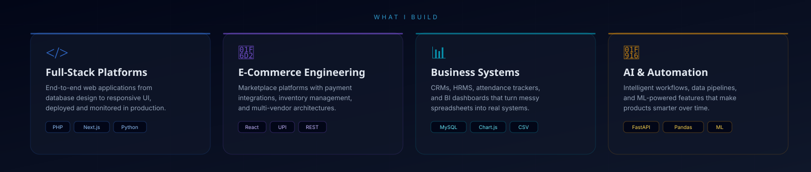
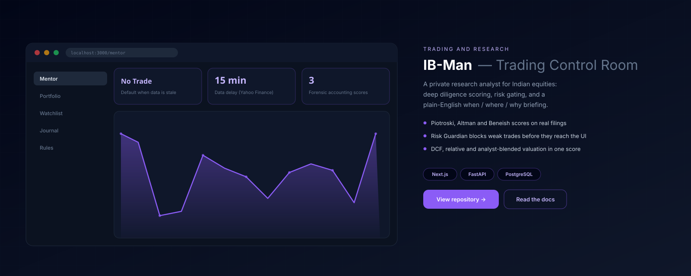
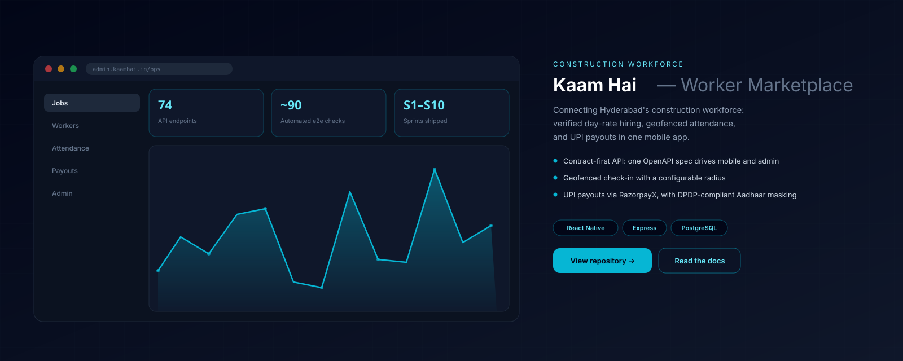
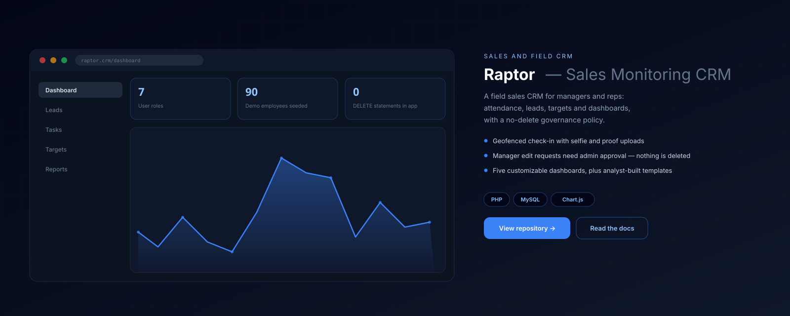
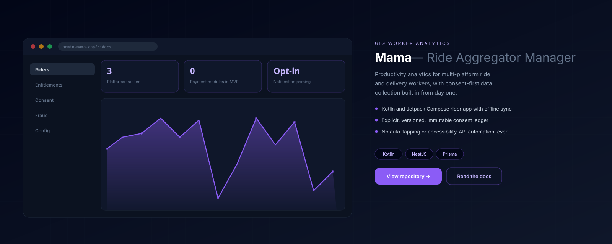
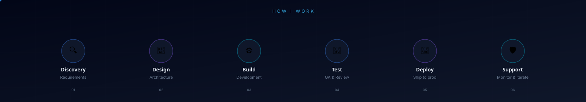

<!-- ═══════════════════════════════════════════════════════════ -->
<!--  Janardhan — GitHub Profile README                       -->
<!--  Theme-adaptive: auto-switches with system light / dark  -->
<!-- ═══════════════════════════════════════════════════════════ -->

<!-- Hero Banner -->
<picture>
  <source media="(prefers-color-scheme: dark)" srcset="assets/hero-dark.svg" />
  <source media="(prefers-color-scheme: light)" srcset="assets/hero-light.svg" />
  
</picture>

 

<!-- Tech Galaxy -->
<picture>
  <source media="(prefers-color-scheme: dark)" srcset="assets/tech-galaxy-dark.svg" />
  <source media="(prefers-color-scheme: light)" srcset="assets/tech-galaxy-light.svg" />
  
</picture>

 

<!-- Services -->
<picture>
  <source media="(prefers-color-scheme: dark)" srcset="assets/services-dark.svg" />
  <source media="(prefers-color-scheme: light)" srcset="assets/services-light.svg" />
  
</picture>

 

## Featured projects

<!-- Rhine -->
<picture>
  <source media="(prefers-color-scheme: dark)" srcset="assets/project-rhine-dark.svg" />
  <source media="(prefers-color-scheme: light)" srcset="assets/project-rhine-light.svg" />
  
</picture>

**[Rhine →](https://github.com/ntor-TJ/Rhine)** — Role-based attendance, timesheet and task management system. `PHP` · `MySQL` · `Bootstrap 5`

 

<!-- IB-Man -->
<picture>
  <source media="(prefers-color-scheme: dark)" srcset="assets/project-ib-man-dark.svg" />
  <source media="(prefers-color-scheme: light)" srcset="assets/project-ib-man-light.svg" />
  
</picture>

**[IB-Man →](https://github.com/ntor-TJ/IB-man)** — Risk-first research and diligence tool for Indian equities. `Next.js` · `FastAPI` · `PostgreSQL`

 

<!-- Kaam Hai -->
<picture>
  <source media="(prefers-color-scheme: dark)" srcset="assets/project-kaam-hai-dark.svg" />
  <source media="(prefers-color-scheme: light)" srcset="assets/project-kaam-hai-light.svg" />
  
</picture>

**[Kaam Hai →](https://github.com/ntor-TJ/kaam_hai)** — Mobile-first marketplace connecting Hyderabad's construction workforce. `React Native` · `Express` · `PostgreSQL`

 

<!-- Raptor -->
<picture>
  <source media="(prefers-color-scheme: dark)" srcset="assets/project-raptor-dark.svg" />
  <source media="(prefers-color-scheme: light)" srcset="assets/project-raptor-light.svg" />
  
</picture>

**[Raptor →](https://github.com/ntor-TJ/Raptor)** — Field sales CRM with geofenced attendance and a no-delete governance model. `PHP` · `MySQL` · `Chart.js`

 

<!-- Mama -->
<picture>
  <source media="(prefers-color-scheme: dark)" srcset="assets/project-mama-dark.svg" />
  <source media="(prefers-color-scheme: light)" srcset="assets/project-mama-light.svg" />
  
</picture>

**[Mama →](https://github.com/ntor-TJ/mama)** — Productivity analytics for multi-platform ride and delivery workers, consent-first by design. `Kotlin` · `NestJS` · `Prisma`

 

<!-- Workflow -->
<picture>
  <source media="(prefers-color-scheme: dark)" srcset="assets/workflow-dark.svg" />
  <source media="(prefers-color-scheme: light)" srcset="assets/workflow-light.svg" />
  
</picture>

---

  Built with purpose under <strong>Spiedee Insight Tech</strong> · Hyderabad, India

